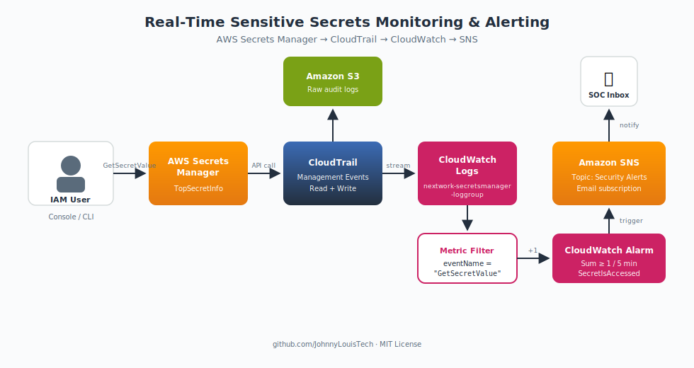

# Real-Time Sensitive Secrets Monitoring and Alerting in AWS

> Unauthorized Secret Access Detection — a cloud security monitoring pipeline built on AWS Secrets Manager, CloudTrail, CloudWatch, and SNS.

[](https://aws.amazon.com/)
[](https://aws.amazon.com/cloudformation/)
[](https://www.terraform.io/)
[](LICENSE)

📖 **Full writeup on Medium:** [Real-Time Sensitive Secrets Monitoring and Alerting in AWS](https://medium.com/@jlouis26/real-time-sensitive-secrets-monitoring-and-alerting-in-aws-b99713718cda)



---

## 📋 Project Scenario

A financial services company stores sensitive database credentials and API keys in AWS Secrets Manager. To improve security monitoring, this project implements a real-time alerting solution using **CloudTrail**, **CloudWatch**, and **SNS** to detect whenever sensitive secrets are accessed.

During testing, a secret is retrieved through both the AWS Console and AWS CLI, which triggers CloudTrail logs, CloudWatch alarms, and SNS email alerts — simulating a cloud security incident detection workflow. This gives a security team rapid visibility into suspicious access attempts and improves response times for potential credential compromise events.

## 🎯 Objectives

- Monitor sensitive secret access activity in real time
- Detect suspicious retrieval of secrets
- Generate cloud security alerts via email
- Improve audit visibility into Secrets Manager API calls
- Simulate SOC monitoring workflows
- Strengthen AWS security operations skills

## 🧰 AWS Services Used

| Service                    | Purpose                                      |
|----------------------------|----------------------------------------------|
| AWS Secrets Manager        | Stores the sensitive secret (`TopSecretInfo`) |
| AWS CloudTrail             | Captures all Secrets Manager API activity    |
| Amazon CloudWatch Logs     | Ingests CloudTrail events for analysis       |
| CloudWatch Metric Filter   | Extracts `GetSecretValue` events             |
| CloudWatch Alarms          | Triggers when secrets are accessed           |
| Amazon SNS                 | Delivers email alerts to subscribers         |
| Amazon S3                  | Stores raw CloudTrail logs                   |
| AWS CLI / CloudShell       | Test access and manually fire alarms         |

## 🚀 Quick Start

You can deploy the full stack with either CloudFormation or Terraform.

### Option 1 — CloudFormation

```bash
aws cloudformation deploy \
  --template-file infrastructure/cloudformation/secrets-monitoring.yaml \
  --stack-name secrets-monitoring \
  --parameter-overrides \
      NotificationEmail=you@example.com \
      SecretName=TopSecretInfo \
  --capabilities CAPABILITY_NAMED_IAM \
  --region us-east-1
```

Confirm the SNS subscription email that lands in your inbox, then run the test script:

```bash
./scripts/test-alert.sh TopSecretInfo us-east-1
```

### Option 2 — Terraform

```bash
cd infrastructure/terraform
terraform init
terraform apply \
  -var="notification_email=you@example.com" \
  -var="secret_name=TopSecretInfo" \
  -var="aws_region=us-east-1"
```

---

## 📐 Step-by-Step Walkthrough (Console)

### Step 1 — Create the Sensitive Secret

Open **Secrets Manager** and create a new secret of type "Other type of secret" named `TopSecretInfo`.


> *TopSecretInfo was successfully created.* This simulates sensitive credentials used in production cloud environments.

---

### Step 2 — Configure CloudTrail Logging

Create a trail (`nextwork-secrets-manager-trail-jl`) that captures management events.

> ⚠️ **Uncheck "Log file SSE-KMS encryption"** — otherwise AWS will charge you for a customer-managed KMS key.


---

### Step 3 — Generate Secret Access Events

Retrieve the secret via Console **and** via the AWS CLI in CloudShell:

```bash
aws secretsmanager get-secret-value --secret-id "TopSecretInfo" --region us-east-1
```


---

### Step 4 — Investigate CloudTrail Events

Filter Event History by event source `secretsmanager.amazonaws.com` and locate the `GetSecretValue` rows.


---

### Step 5 — Send Logs to CloudWatch

Enable CloudWatch Logs integration on the trail and verify events arrive in `nextwork-secretsmanager-loggroup`.


---

### Step 6 — Create the CloudWatch Metric Filter

Pattern: `GetSecretValue`. Namespace: `SecurityMetrics`. Metric name: `SecretIsAccessed`. Value: `1`.


---

### Step 7 — Create the CloudWatch Alarm

Statistic: `Sum`. Period: `5 minutes`. Threshold: `≥ 1`.


---

### Step 8 — Configure SNS Notifications

Create SNS topic `Security Alerts` and subscribe your email. Confirm the subscription from the email link.


---

### Step 9 — Trigger the Security Incident

Retrieve the secret again to validate the full pipeline.


---

### Step 10 — Investigate the Alert

Confirm CloudTrail captured the event, the metric filter matched, the alarm fired, and the email landed.


---

## 🧪 Testing the Alarm

Trigger the alarm manually without waiting for metric aggregation:

```bash
aws cloudwatch set-alarm-state \
  --alarm-name "SecretIsAccessedAlarm" \
  --state-value ALARM \
  --state-reason "Manually triggered for testing"
```

Or trigger the full pipeline by reading the secret:

```bash
aws secretsmanager get-secret-value \
  --secret-id TopSecretInfo \
  --region us-east-1
```

You should receive an email titled **ALARM: "SecretIsAccessedAlarm"** within a few minutes.

## 🗂️ Repository Layout

```
.
├── README.md
├── LICENSE
├── .gitignore
├── docs/
│   ├── architecture.md
│   ├── runbook.md
│   └── images/
│       ├── README.md                  ← filename map for screenshots
│       ├── architecture.svg           ← generated diagram
│       └── 01-…63-…png                ← drop your screenshots here
├── infrastructure/
│   ├── cloudformation/
│   │   └── secrets-monitoring.yaml
│   └── terraform/
│       ├── main.tf
│       ├── variables.tf
│       └── outputs.tf
└── scripts/
    ├── test-alert.sh
    └── trigger-alarm.sh
```

## 🧹 Cleanup

To avoid ongoing charges (CloudTrail S3 storage, CloudWatch Logs ingest):

```bash
# CloudFormation
aws cloudformation delete-stack --stack-name secrets-monitoring

# Terraform
cd infrastructure/terraform && terraform destroy
```

## 📝 License

MIT — see [LICENSE](LICENSE).

## 👤 Author

**Johnny Louis** — Cloud Engineer passionate about DevOps & Security.

- Medium: [@jlouis26](https://medium.com/@jlouis26)
- GitHub: [@JohnnyLouisTech](https://github.com/JohnnyLouisTech)
